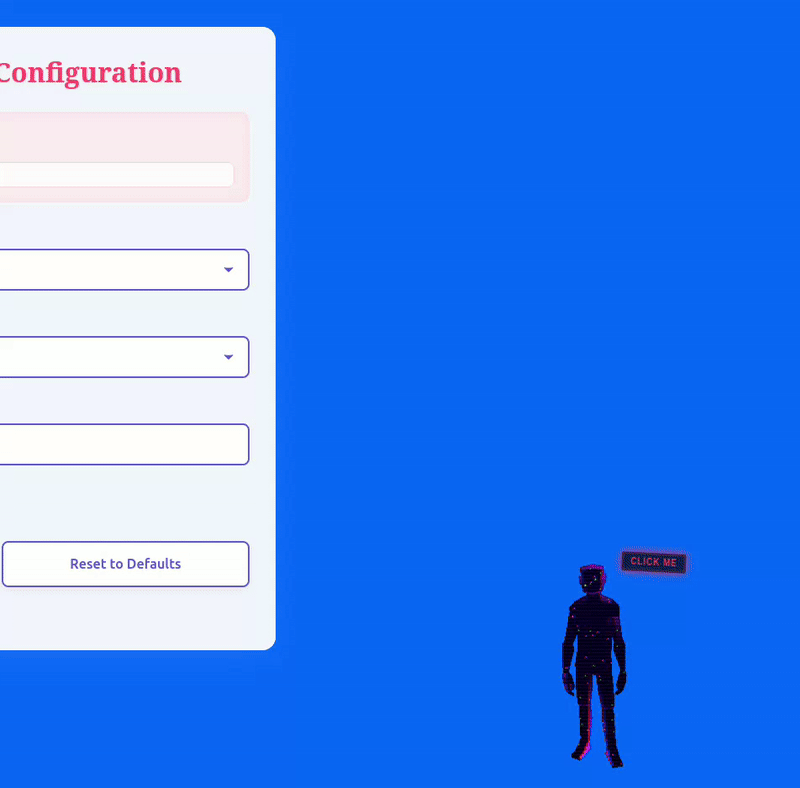

# PersonaMotion

A web extension featuring an LLM-based animated avatar with future interactive capabilities.

## Overview

PersonaMotion is a web extension that provides an animated 3D avatar powered by Large Language Models (Claude, Gemini, or OpenAI). The avatar uses Three.js for 3D rendering, Brain.js for neural processing, and can be bundled for standalone web applications.



## Current Features

- **3D Animated Avatar**: GLTF model-based character with realistic animations
- **LLM Integration**: Supports Claude, Gemini, and OpenAI models
- **Web Extension**: Browser extension with bundling capabilities
- **3D Rendering**: Three.js with CCDI inverse kinematics and trackball controls
- **Neural Processing**: Brain.js integration for intelligent responses
- **Web Workers**: Background processing for smooth performance

## Planned Features (Coming Soon)

- **User Interactions**: Interactive conversations with the avatar
- **Voice Learning**: Voice recognition and speech synthesis capabilities
- **Personality Development**: Adaptive personality traits based on interactions
- **Enhanced Animations**: More sophisticated facial expressions and gestures

## To Load as browser extension
- Chrome: Go to chrome://extensions/, enable Developer mode, click "Load unpacked"
- Firefox: Go to about:debugging, click "This Firefox", click "Load Temporary Add-on"

### Install packages for bundling and running test server
```bash
# Clone the repository
git clone https://github.com/yogibht/personamotion.git

# Navigate to project directory
cd personamotion/test-server

# Install dependencies
npm install
```

### Create a runnable web app bundle (WIP Docs for this)
```bash
# Build the bundle
npm run build
```

## Web App Bundle Usage

### Standalone HTML Implementation
```html
<!doctype html>
<html>
    <head>
        <meta charset="UTF-8" />
        <title>Welcome To PersonaSync</title>
        <link rel="stylesheet" href="/personamotionstyles.css" />
        <script src="/lib/brain.js"></script>
        <script src="/lib/three.min.js"></script>
        <script src="/lib/CCDIKSolver.js"></script>
        <script src="/lib/TrackballControls.js"></script>
        <script src="/lib/GLTFLoader.js"></script>
        <script src="/personamotionbundle.js" defer></script>
    </head>
    <body>
        <script>
            const ENV = {
                API: {
                    GEMINI: {
                        key: "YOUR_GEMINI_API_KEY",
                        url: "https://generativelanguage.googleapis.com/v1beta/models/gemini-2.0-flash:generateContent",
                    },
                    OPENAI: {
                        key: "YOUR_OPENAI_API_KEY",
                        url: "https://api.openai.com/v1/chat/completions",
                    },
                    CLAUDE: {
                        key: "YOUR_CLAUDE_API_KEY",
                        url: "https://api.anthropic.com/v1/messages",
                    },
                },
            };
            const worker = new Worker("/worker.js");
            const modelURL = "/models/persona.glb";
            window.addEventListener("DOMContentLoaded", async () => {
                await startPersonaMotion({
                    worker,
                    modelURL,
                    ENV,
                });
            });
        </script>
    </body>
</html>
```

### Setup Steps
1. Add your preferred LLM API key(s) to the ENV configuration:
   - Gemini: Get key from Google AI Studio
   - OpenAI: Get key from OpenAI Platform
   - Claude: Get key from Anthropic Console
2. Ensure all required files are in the correct directories:
   - `/lib/` - JavaScript libraries
   - `/models/persona.glb` - 3D avatar model
   - `/personamotionbundle.js` - Main application bundle
   - `/worker.js` - Web worker script
   - `/personamotionstyles.css` - Stylesheets
3. Load the HTML file in a web browser

## Roadmap

- [ ] Add neural map download functionality (export Brain.js neural map as DataURL image)
- [ ] Feed neural map images to LLM for AI-powered insights
- [ ] Implement CCDIKSolver examples from Three.js for enhanced avatar movement
- [ ] Create system to feed all user data into Brain.js neural networks
- [ ] Develop heatmap visualization system for user data analysis
- [ ] Build LLM integration for analyzing user data and heatmaps
- [ ] Add minimizer control (top-right) to show only BrainVZ with toggle functionality
- [ ] Add user interaction capabilities
- [ ] Implement voice recognition
- [ ] Add speech synthesis
- [ ] Enhance avatar animations
- [ ] Develop personality learning system

## Contributing

This project was primarily developed using AI services with human assistant. Contributions welcome!

## License

Anyone can do anything with this code.

---

*A simple animated avatar that will grow into an interactive AI companion.*
